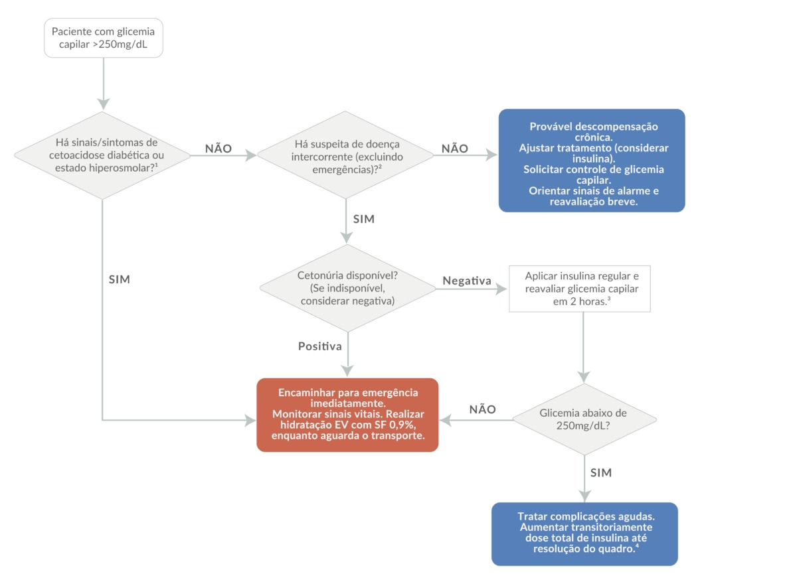
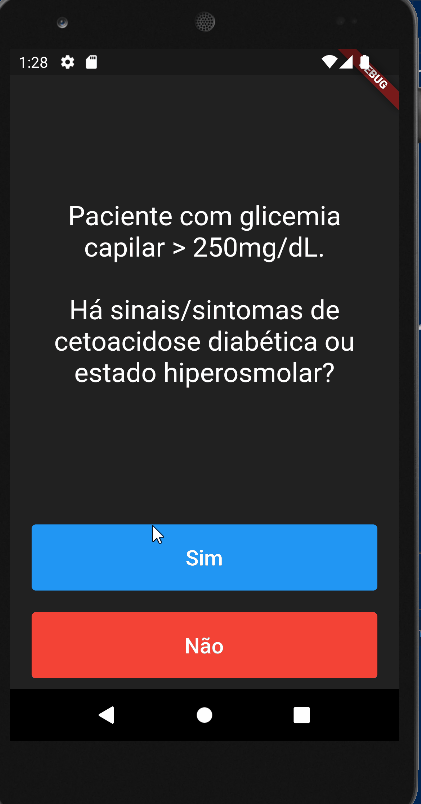

# Apoio a paciente com diabetes

Você deve construir um aplicativo _mobile_ para auxiliar médicos
do pronto-socorro que precisam atender pacientes com diabetes.
O fluxograma a seguir foi encaminhado para você:

Um esqueleto do aplicativo é fornecido junto a este repositório. O leiaute também foi fornecido. Mas você deve terminar o aplicativo, implementando as funcionalidades necessárias para que ele funcione corretamente.

## Aplicativo em funcionamento

O aplicativo deve funcionar conforme o vídeo a seguir:

## Instruções para o desenvolvimento

1. Clone este repositório para o seu computador.
2. Implemente a classe `Step`. Esta classe deve ter 3 atributos: `text`, que representa o texto do passo atual, `choice1`, que representa o texto do primeiro botão e `choice2`, que representa o texto do segundo botão. O primeiro botão e o texto do passo atual são obrigatórios. O texto do segundo botão é opcional, então pode ter um valor `null`. Os três campos são `String`s.
3. Implemente a classe `StateMachine`. Essa classe vai representar a máquina de inferência da mudança de estados e ela deve representar o fluxograma acima. Para isso, uma lista de `Step`s foi fornecida.
4. Você deve implementar o método `nextStep()`, na classe `StateMachine` que deve retornar o próximo passo da máquina de inferência, conforme o fluxograma.
5. Você deve ocultar as informações dos `Step`s; para isso você deve implementar métodos para obter o texto do passo atual e os textos dos botões. Esses métodos devem ser usados pela classe `_DiabetesHelperPageState` para atualizar a interface gráfica.
6. Você deve implementar o método `reset()`, que deve reiniciar a máquina de inferência, voltando ao primeiro passo, no caso do botão "Reiniciar" ser pressionado.
7. Você deve fazer com que os botôes da interface gráfica chamem o método `nextStep()` e o método `reset()`, conforme o caso. E que a interface seja atualizada conforme os passos avancem.
8. O segundo botão é opcional. Nos casos _fim_ (os coloridos, no fluxograma) ele não deve aparecer. Você deve utilizar um `Widget` `Visibility` para controlar a visibilidade deste botão. O `Visibility` deve ser configurado para ser visível quando o texto do segundo botão for diferente de `null` e invisível quando o texto for `null`. Utilize [este link](https://api.flutter.dev/flutter/widgets/Visibility-class.html) para saber mais sobre o `Visibility`.

9. Execute seu aplicativo e verifique o fluxo das histórias.
10. Você deve entregar seu aplicativo através de um repositório git, gerado para você ao aceitar a tarefa no github classroom. 

NÃO SE ESQUEÇA DE POSTAR O REPOSITÓRIO NA TAREFA DO TEAMS. SEM ELE NÃO SERÁ POSSÍVEL AVALIAR SEU ENVIO.
